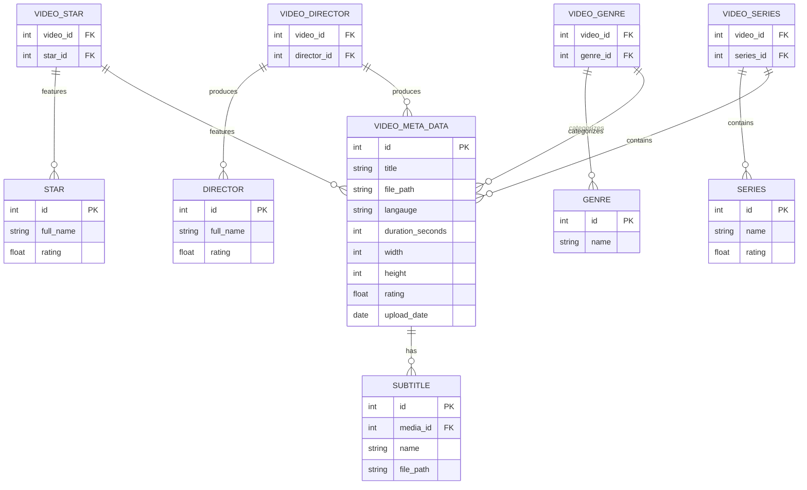
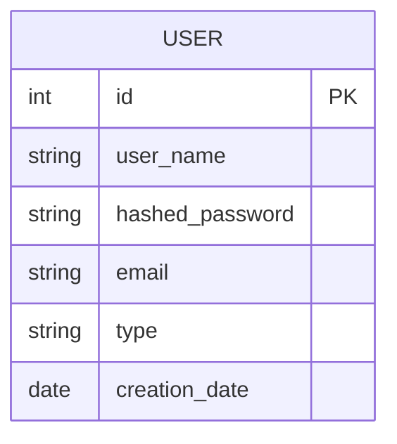

# ER-Diagram

## Video DB

```mermaid
erDiagram

    VIDEO_META_DATA ||--o{ SUBTITLE : has


    VIDEO_STAR ||--o{ STAR : features
    VIDEO_STAR ||--o{ VIDEO_META_DATA : features

    VIDEO_DIRECTOR ||--o{ DIRECTOR : produces
    VIDEO_DIRECTOR ||--o{ VIDEO_META_DATA : produces

    VIDEO_GENRE ||--o{ GENRE : categorizes
    VIDEO_GENRE ||--o{ VIDEO_META_DATA : categorizes

    VIDEO_SERIES ||--o{ SERIES : contains
    VIDEO_SERIES ||--o{ VIDEO_META_DATA : contains

    VIDEO_META_DATA{
        int id PK
        string title
        string file_path
        string langauge
        int duration_seconds
        int width
        int height        
        float rating
        date upload_date
    }

    DIRECTOR{
        int id PK
        string full_name  
        float rating
    }

    STAR{
        int id PK
        string full_name  
        float rating
    }

    SERIES{
        int id PK
        string name
        float rating
    }

    GENRE{
        int id PK
        string name  
    }

    SUBTITLE{
        int id PK
        int media_id FK
        string name
        string file_path  
    }

    VIDEO_DIRECTOR{
        int video_id FK
        int director_id FK
    }
    VIDEO_STAR{
        int video_id FK
        int star_id FK
    }
    VIDEO_GENRE{
        int video_id FK
        int genre_id FK
    }
    VIDEO_SERIES{
        int video_id FK
        int series_id FK
    }


```

## Managment DB

```mermaid
erDiagram

    USER{
        int id PK
        string user_name
        string hashed_password
        string email
        string type
        date creation_date
    }

```